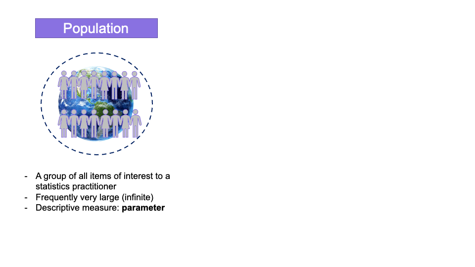

class: inverse, normalsize, center, middle
# Introduction to statistics

---
class: normalsize
# What is statistics?
- **Statistics is a way to get information from data**
- **Key statistical concepts**

---
class: normalsize
# Key statistical concepts
```{r echo=FALSE, fig.align='center', message=FALSE, out.width='100%', warning=F}

```

---
class: normalsize
# Key statistical concepts
```{r echo=FALSE, fig.align='center', message=FALSE, out.width='100%', warning=F}

```

---
class: normalsize
# Key statistical concepts
```{r echo=FALSE, fig.align='center', message=FALSE, out.width='100%', warning=F}

```

---
class: normalsize
# Key statistical concepts
```{r echo=FALSE, fig.align='center', message=FALSE, out.width='100%', warning=F}

```

---
class: normalsize
# Types of statistics
```{r echo=FALSE, fig.align='center', message=FALSE, out.width='100%', warning=F}

```

---
class: normalsize
# Types of statistics
```{r echo=FALSE, fig.align='center', message=FALSE, out.width='100%', warning=F}

```

---
class: normalsize
# Measures of central tendency
```{r echo=FALSE, fig.align='center', message=FALSE, out.width='100%', warning=F}

```

---
class: normalsize
# Measures of central tendency
```{r echo=FALSE, fig.align='center', message=FALSE, out.width='100%', warning=F}

```

---
class: normalsize
# Measures of central tendency
```{r echo=FALSE, fig.align='center', message=FALSE, out.width='100%', warning=F}

```

---
class: normalsize
# Measures of central tendency
```{r echo=FALSE, fig.align='center', message=FALSE, out.width='100%', warning=F}

```

---
class: normalsize
# Measures of central tendency
```{r echo=FALSE, fig.align='center', message=FALSE, out.width='100%', warning=F}

```

---
class: normalsize
# Measures of central tendency
```{r echo=FALSE, fig.align='center', message=FALSE, out.width='100%', warning=F}

```

---
class: normalsize
# Measures of central tendency
```{r echo=FALSE, fig.align='center', message=FALSE, out.width='100%', warning=F}

```

---
class: normalsize
# Measures of central tendency
```{r echo=FALSE, fig.align='center', message=FALSE, out.width='100%', warning=F}

```

---
class: normalsize
# Measures of central tendency
```{r echo=FALSE, fig.align='center', message=FALSE, out.width='100%', warning=F}

```

---
class: normalsize
# Measures of variability
```{r echo=FALSE, fig.align='center', message=FALSE, out.width='100%', warning=F}

```

---
class: normalsize
# Measures of variability
```{r echo=FALSE, fig.align='center', message=FALSE, out.width='100%', warning=F}

```


---
class: normalsize
# Measurement

```{r echo=FALSE, fig.align='center', message=FALSE, out.width='100%'}

```

---
class: normalsize
# Variables and Measurement

.acid-green[**Variable**]

.center[
.content-box-blue[
- How much POSTECH students spend .acid-green[time] on SNS a day?
- What is the average .acid-green[IQ score] of POSTECH?
- What is the .acid-green[average GPA] of POSTECH students? Is it higher than the .acid-green[national average]?
]
]

---
class: normalsize
# Variables and Measurement

.acid-green[**Variable**]: a characteristic that can vary in value among subjects in a sample or population
.center[
.content-box-blue[
- Income last year : $ xxxxxx 
- Number of siblings : 0, 1, 2, 3...
- Emplyed or not: YES or NO
- Gender: Female or Male
]
]

**Variables** have different measurement scales

---
class: normalsize
# Variables and Measurement
**Measurement scale**

- **Quantitative**:measurement scale has numerical values that represent different magnitudes of the variable
  - Example: annual income,number of siblings,age, # of years of education completed

- **Qualitative**: when measurement scale is a set of categories
  - Example:marital status (single, married ...), nationality, religious affiliation
  - Distinct categories differ in quality not in numerical magnitude (qualitative)

---
class: normalsize
# Variables and Measurement

**Quantitative variables**

- Interval
- Ratio
- Ordinal
- Nominal

---
class: normalsize
# Interval scale
- Ordered category with equal intervals
  - Separate adjacent scores and arbitrary zero
  - Example:temperature
  
```{r echo=FALSE, fig.align='center', message=FALSE, out.width='20%'}

```

---
class: normalsize
# Ratio scale
- Existence of an absolute 'zero' point
  - You can measure the absolute amount of variable
  - Allows to calculate 'ratio'
  - Example: 10 liter of water in a jar has twice as much water as a jar of 5 liter
```{r echo=FALSE, fig.align='center', message=FALSE, out.width='100%', warning=F}
knitr::include_graphics('pic/ruler.png')
```
---
class: normalsize
# Ordinal scale
- Consists of a set of categories that are organized in _an ordered sequence_
- You can think of ordinal scale as a _rank order_
  - Example:
    - 1st, 2nd, 3rd...(rank)
    - small, medium, large
    - Bronze, silver, gold medal
    - Never, less than once a month, 1 - 3 times a month, every week, more than once a week
    
```{r echo=FALSE, fig.align='center', message=FALSE, out.width='40%', warning=F}

```

---
class: normalsize
# Nominal scale (qualitative)
- Consists of a set of categories that have different names
- Do no make any quantitative distinctions between observations
  - Example: Your primary mode of transportation to work
      - Automobile, bus, subway, bicycle, walking
- No category is greater than or smaller than any other category

```{r echo=FALSE, fig.align='center', message=FALSE, out.width='50%', warning=F}

```

---
class: normalsize
# Measurement scale
```{r echo=FALSE, fig.align='center', message=FALSE, out.width='100%', warning=F}

```
---
class: small
# Recap
```{r echo=FALSE, fig.align='center', message=FALSE, out.width='70%', warning=F}

```

---
class: inverse, normalsize, center, middle
# Next class (3/2)

Exploratory data analysis with visualization

Excel workout

